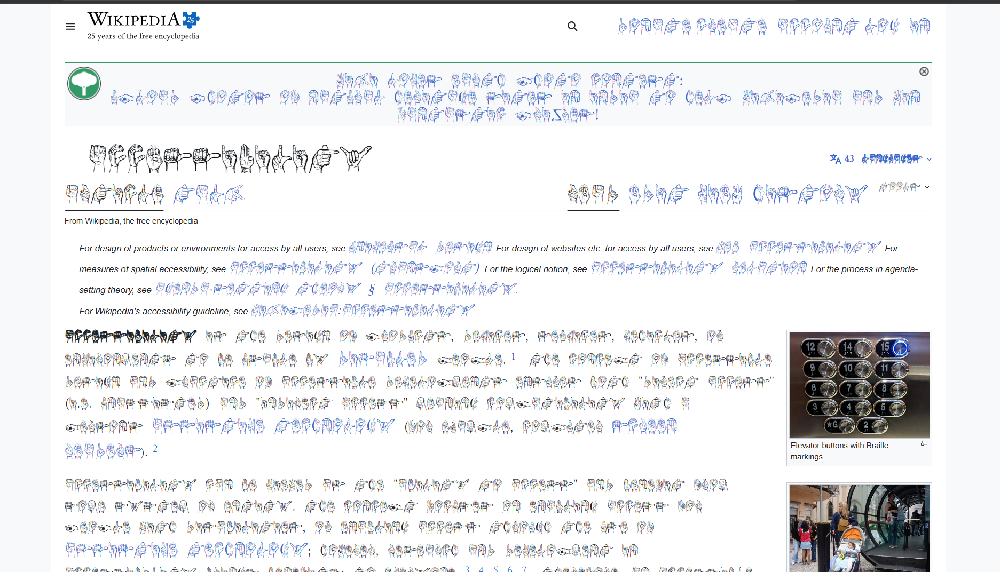
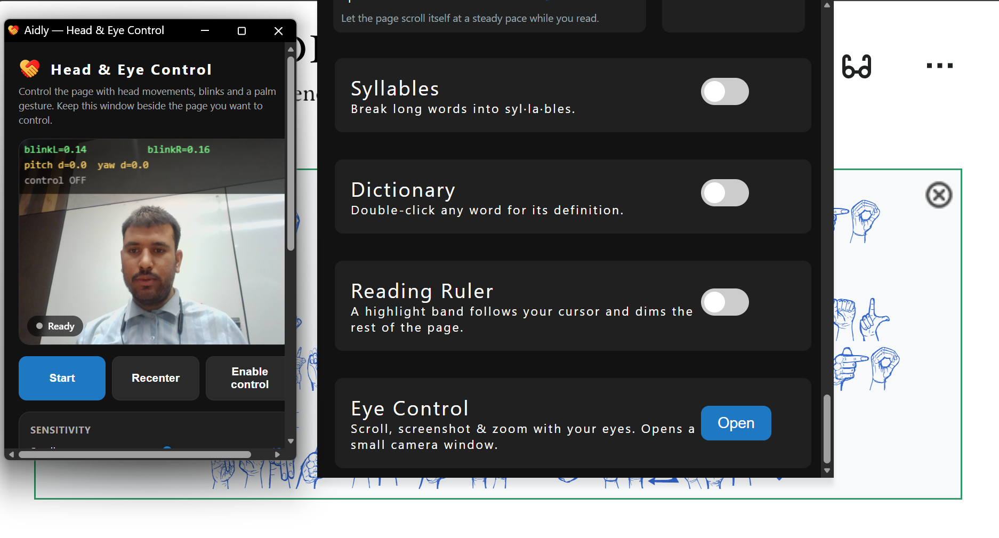
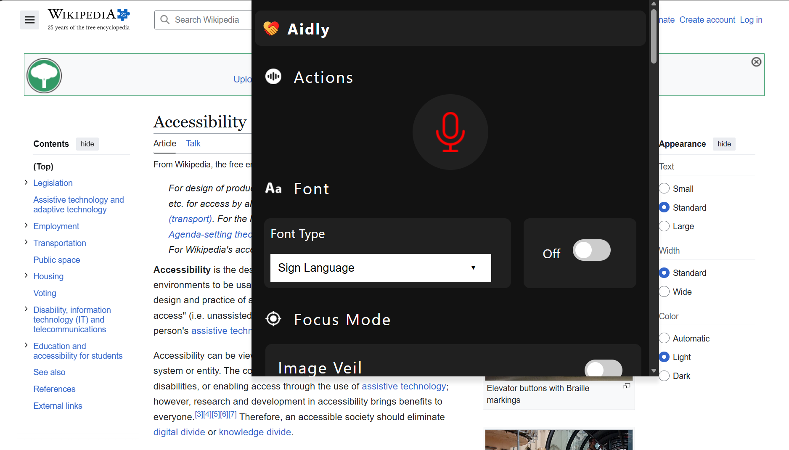
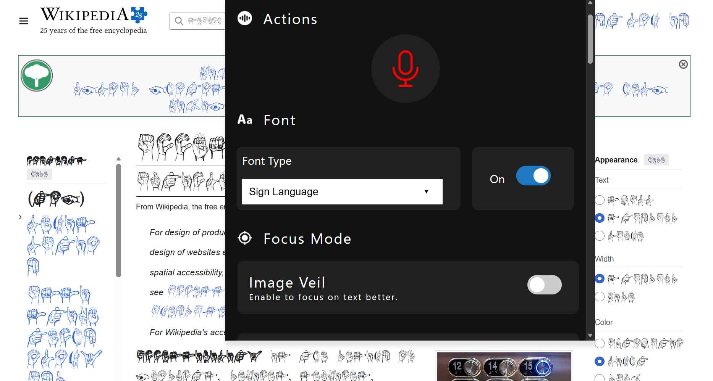

<p align="center">
  
</p>

<h1 align="center">Aidly</h1>

<p align="center"><em>Hands-free, on device web accessibility for everyone.</em></p>

**Aidly** is a Chrome (Manifest V3) extension that makes the web more accessible for
everyone. It bundles a suite of reading aids, low-vision and color-blindness support,
dyslexia-friendly typography, and **hands-free control** of the page using your head,
eyes and a palm gesture via the webcam.

All processing runs **locally in the browser** — the camera vision pipeline
(MediaPipe) never leaves your machine. The only network call is an optional dictionary
lookup to `api.dictionaryapi.dev` when you use the double-click dictionary.

---

## Highlights

| Category | Features |
| --- | --- |
| **Reading** | Bionic Reading, Reading Ruler, Read Aloud (whole page, play/pause/speed), Reader Mode, Syllable splitter, Double-click Dictionary |
| **Typography** | Dyslexia-friendly fonts (Open Dyslexic, Lexend, …), font size, font color, text stroke, line/letter/word spacing |
| **Vision** | Color-blind correction (protanopia / deuteranopia / tritanopia + intensity), image magnifier, emphasize links, image veil |
| **Hands-free** | Head-tilt scroll & zoom, blink screenshot / bring-to-top, **Open-palm pause/resume**, voice commands |
| **Utilities** | Custom cursors, print page, screenshot to clipboard |

See [`docs/FEATURES.md`](docs/FEATURES.md) for the full list and how each one works.

---

## Screenshots

**Reading aids & typography applied to a live page**



**Head & Eye Control — sensitivity sliders and the gesture guide**



**Eye Control window with the live webcam preview**



**Hands-free gesture controls in action**



---

## Install (load unpacked)

1. Open `chrome://extensions` in Chrome or Edge.
2. Enable **Developer mode** (top-right).
3. Click **Load unpacked** and select the `Aidly` folder (the one containing
   `manifest.json`).
4. Pin **Aidly** from the extensions menu and click the icon to open the popup.

Full instructions, permissions rationale and troubleshooting are in
[`docs/INSTALL.md`](docs/INSTALL.md).

---

## Project layout

```
Aidly/
├── manifest.json              # MV3 manifest
├── src/
│   ├── background.js          # Service worker: install defaults, context menus,
│   │                          # keyboard commands, gesture-command routing
│   ├── content/
│   │   ├── content.js         # All on-page features (injected into every tab)
│   │   └── content.css        # Styles for injected UI
│   ├── popup/                 # Toolbar popup (the main control panel)
│   │   ├── popup.html / .css / .js
│   ├── options/               # Options page (voice actions opt-in)
│   ├── eye-control/           # Hands-free camera window
│   │   ├── eye-control.html / .js
│   │   └── eye-control.worker.js   # Keep-alive ticker (runs when minimized)
│   └── screenshot/            # Helper page for the manual screenshot button
├── vendor/                    # Third-party libraries (jQuery, MediaPipe Tasks)
│   ├── jquery.min.js
│   ├── jquery.lettering.min.js
│   └── mediapipe/             # vision_bundle.mjs + wasm/
├── models/                    # MediaPipe model files (.task)
├── assets/
│   ├── icons/                 # Extension icons + logo
│   ├── images/                # UI images and cursors
│   └── fonts/                 # Dyslexia/display fonts + their @font-face CSS
└── docs/                      # Architecture, features and install guides
```

A deeper explanation of how the pieces fit together is in
[`docs/ARCHITECTURE.md`](docs/ARCHITECTURE.md).

---

## Development

- The code targets **Manifest V3** and uses no build step — load the folder directly.
- Formatting is handled by [Prettier](https://prettier.io) (`.prettierrc`).
- The camera pipeline uses the **MediaPipe Tasks** vision bundle, which is bundled
  locally (eval-free) to comply with the MV3 content security policy.

### Reloading after changes

After editing any file, return to `chrome://extensions` and click **Reload** on the
Aidly card. The camera window is a separate window — close and reopen it to pick up
changes to `src/eye-control/*`.

---

## Privacy

- The webcam stream is processed entirely on-device; no video, image or landmark data
  is uploaded anywhere.
- The double-click dictionary sends only the single selected word to
  `api.dictionaryapi.dev`.
- Settings are stored with `chrome.storage.sync` so they follow your browser profile.

---

## Credits & license

Aidly is released under the [MIT License](LICENSE).

Aidly began as a rebrand and major extension of the open-source **Someity** accessibility
project (MIT, © 2021 Rohan Lekhwani and Aaditya Joshi). The original copyright notice is
retained in [`LICENSE`](LICENSE) as required. The hands-free head/eye/palm control,
reading suite, color-blind correction and the production restructure were added on top.

Computer-vision powered by [Google MediaPipe](https://developers.google.com/mediapipe).
